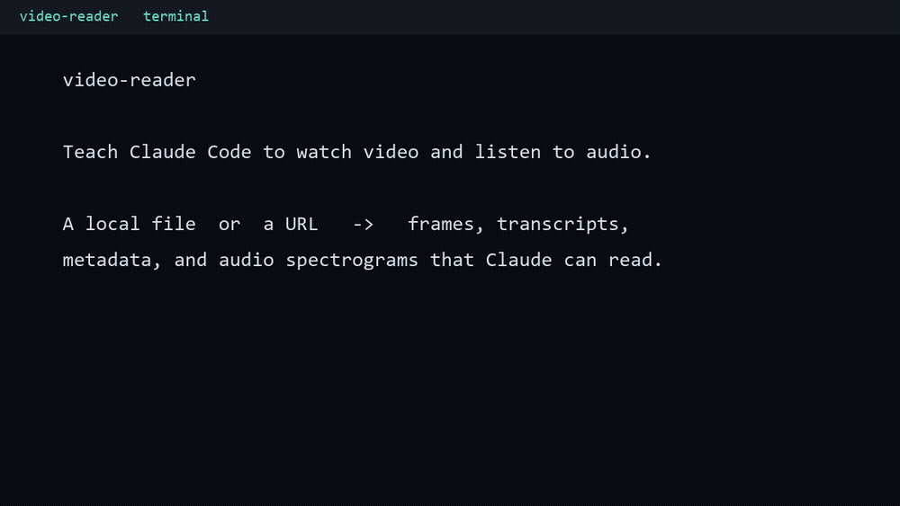

# 🎬 video-reader

**Teach Claude Code to watch video and listen to audio.** A Claude Code skill that turns any
video — a local file *or* a URL — into things Claude can actually read.

[](LICENSE)
[](https://docs.claude.com/en/docs/claude-code)


Claude can't open a `.mp4`. This skill bridges that gap by driving `ffmpeg`/`ffprobe` (and optionally
`whisper` and `yt-dlp`) to convert a video into artifacts Claude *can* read:

- 🖼️ **Frames** it can see and describe
- 📝 **Timestamped transcripts** of speech
- ℹ️ **Metadata** — duration, resolution, codecs, streams
- 🔊 **Audio spectrogram + waveform** — reason about sound design *without hearing it*
- 🌐 **URL downloads** — point it at a link, not just a local file

<!-- Replace with your own recording once you've captured one -->


> Ask Claude *"what happens in demo.mp4?"*, *"transcribe this recording"*, or *"find the part of the
> screencast where the error pops up"* — it loads this skill and drives the right tool automatically.

---

## Install

### Option A — as a plugin (recommended)

In Claude Code:

```
/plugin marketplace add MaximRomanMd/video-reader
/plugin install video-reader@maximromanmd
```

### Option B — as a standalone skill

Copy the skill folder into your Claude Code skills directory:

```bash
# macOS / Linux
git clone https://github.com/MaximRomanMd/video-reader
cp -r video-reader/skills/video-reader ~/.claude/skills/video-reader
```

```powershell
# Windows
git clone https://github.com/MaximRomanMd/video-reader
Copy-Item -Recurse video-reader\skills\video-reader "$env:USERPROFILE\.claude\skills\video-reader"
```

Claude Code discovers it on the next session.

---

## Dependencies

The skill checks for these and prints the exact install command if one is missing.

| Capability | Needs | Install |
|---|---|---|
| Frames · metadata · audio maps (core) | `ffmpeg` / `ffprobe` | `winget install Gyan.FFmpeg` · `brew install ffmpeg` · `apt install ffmpeg` |
| Transcription | `faster-whisper` (recommended) or `openai-whisper` | `pip install faster-whisper` |
| URL download | `yt-dlp` | `pip install yt-dlp` |

Only `ffmpeg` is required for the core experience; the rest are pulled in only when you use that feature.

---

## Use the scripts directly (no agent required)

```bash
python skills/video-reader/scripts/probe.py       video.mp4
python skills/video-reader/scripts/frames.py      video.mp4 --mode scene --max 8
python skills/video-reader/scripts/audiomap.py    video.mp4
python skills/video-reader/scripts/transcribe.py  video.mp4 --model small --language en
python skills/video-reader/scripts/fetch.py       "https://example.com/clip" --audio-only
```

Run any script with `-h` for its full option list.

## How it works

`skills/video-reader/SKILL.md` is the instruction sheet Claude follows; `scripts/` holds thin,
stdlib-only Python wrappers around `ffmpeg`/`ffprobe`/`whisper`/`yt-dlp`. Frames are downscaled and
capped by default so reading them doesn't blow up the agent's context window.

## Contributing

Issues and PRs welcome — see [CONTRIBUTING.md](CONTRIBUTING.md).

## License

MIT © 2026 Maxim Roman — see [LICENSE](LICENSE).
